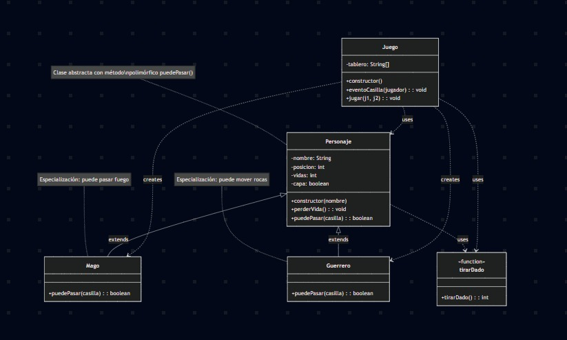

# tlp4-Clase05

DIAGRAMA DE CLASES SIMPLE



DESCRIPCION DEL DISEÑO Y DECISIONES PRINCIPALES:

Cada clase tiene su propia función y no hace cosas de otras clases. Personaje y sus subclases (Mago y Guerrero) solo se encargan de las habilidades y movimientos de los personajes. La clase Juego se ocupa de manejar cómo avanza el juego y cómo interactúan los personajes con el tablero. Todo lo relacionado con preguntar nombres o leer opciones del jugador se hace fuera de estas clases, usando prompt-sync, para que las clases solo tengan la lógica del juego. Si un jugador elige ser Mago o Guerrero, el otro jugador recibe automáticamente la clase que queda, sin necesidad de elegir.

COMO EJECUTAR EL JUEGO DESPUES DE CLONAR EL REPOSITORIO:

1. Instalar Node.js (si no lo tenés aún)
Node.js es el entorno que permite ejecutar JavaScript fuera del navegador.
Descargalo desde https://nodejs.org (recomendado instalar la versión LTS).
Durante la instalación, asegurate de marcar la opción "Add to PATH" para que se pueda usar desde la terminal.

2. Abrir la terminal (CMD)
Presioná Win + R, escribí cmd y presioná Enter.
Ir a la carpeta del juego
Usá el comando cd para cambiar a la carpeta donde está el proyecto.
Por ejemplo:
cd C:\Users\ipformosa\Desktop\practicatlp\juegorpg

3. Instalar dependencias necesarias
El juego usa la librería prompt-sync para leer datos por consola.

```bash
npm i
```

4. Ejecutar el juego
Una vez instalada la librería, podés iniciar el juego con:

```bash
node app.js
```